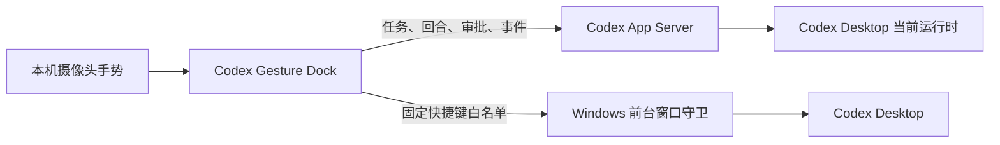

# Windows 桌面控制设计

本文定义 Codex Gesture Dock 的 Windows 桌面控制边界和演进路线。目标不是做通用远程控制器，而是为 Codex 工作流提供可观察、可撤销、白名单化的桌面操作。

## 当前架构

Dock 目前有两条控制通道：

1. **App Server 通道**：读取任务和完成文件，启动或追加回合，处理由 Dock 发起回合产生的命令/文件审批，并监听线程、回合和条目事件。
2. **Windows 通道**：只对经过进程、窗口和前台焦点复核的 Codex 窗口发送固定快捷键。它用于快速对话、语音输入、命令菜单、代码审查、终端和侧栏等桌面 UI 功能。

App Server 的初始化、线程/回合 API、审批请求和流式通知遵循 [OpenAI Codex App Server protocol](https://learn.chatgpt.com/docs/app-server)。

启动时 Dock 会优先发现 Codex Desktop 最新的版本化运行时，而不是旧的稳定路径；界面同时显示 App Server、Windows 桌面窗口和当前绑定任务的状态。用户在任务窗口选择任务后，绑定会保存在本机用户配置中。

## 控制边界

| 能力 | 当前方式 | 边界 |
| --- | --- | --- |
| 任务读取与打开 | App Server + `codex://` | 仅本机 Codex 任务 |
| 继续、总结、审查、测试修复 | `turn/start` / `turn/steer` | 只发送固定意图模板 |
| 命令和文件审批 | App Server 服务端请求 | 仅 Dock 发起回合；只允许本次或拒绝 |
| 快捷键动作 | Windows 前台守卫 | 固定动作白名单，不接收任意按键文本 |
| 文件打开与定位 | Electron shell | 仅来自 App Server 最近文件清单的短期 ID |
| 任意窗口点击、键盘输入、密码框 | 不支持 | 不进入默认能力范围 |

Dock 使用独立 App Server 连接，因此不能接管另一个客户端已经持有的审批弹窗。对于由 Codex Desktop 自身启动的回合，Dock 通过轮询任务状态保持可见性；只有从 Dock 发起的回合会把审批请求路由回 Dock。

## 分阶段路线

### 阶段 1：只读桌面观察

- 枚举顶层 Codex 窗口，记录进程 ID、标题、可见性和前台状态。
- 使用 `SetWinEventHook` 订阅窗口创建、销毁、焦点和位置变化，作用域限制到目标进程。
- 在诊断界面展示能力检测结果，不执行输入。

### 阶段 2：UI Automation 元素发现

- 使用 Windows UI Automation 读取目标窗口的元素树、控件类型、AutomationId、名称和可用 Control Pattern。
- 选择器优先级为 AutomationId、ControlType 与结构路径；可见文本只作为受版本影响的回退条件。
- 建立 Codex 版本到选择器能力的兼容矩阵，并为缺失元素提供明确降级状态。

### 阶段 3：白名单语义动作

- 只暴露诸如“打开任务搜索”“聚焦输入框”“切换终端”的语义动作。
- 优先调用 UI Automation 的 Invoke、Toggle、Selection 或 Value Pattern。
- 只有目标元素不可自动化时才使用现有快捷键桥；坐标点击不作为默认回退。
- 每次执行前重新验证进程、窗口和元素仍属于 Codex，执行后读取 UI 状态确认结果。

### 阶段 4：策略与审批

- 每个应用、窗口和动作都有独立白名单；没有通用“执行任意输入”入口。
- 文件系统、终端命令、凭证窗口和系统设置继续走显式审批。
- 记录本机审计事件：动作名、目标进程、结果和时间；不记录输入正文、任务消息或屏幕内容。
- 为手势动作提供紧急停止、冷却时间和应用失焦即取消。

## Windows 平台限制

- Windows UI Automation 提供元素树、属性、Control Pattern 和事件，是后续语义控制的首选接口。[Microsoft UI Automation overview](https://learn.microsoft.com/en-us/windows/win32/winauto/uiauto-uiautomationoverview)
- `SetWinEventHook` 可把事件监听限制到进程或线程，适合低权限的只读窗口观察。[Microsoft SetWinEventHook](https://learn.microsoft.com/en-us/windows/win32/api/winuser/nf-winuser-setwineventhook)
- `SendInput` 受 User Interface Privilege Isolation 约束，只能向同等或更低完整性级别的进程注入输入，而且失败不一定明确报告为 UIPI 阻止。[Microsoft SendInput](https://learn.microsoft.com/en-us/windows/win32/api/winuser/nf-winuser-sendinput)
- Windows 对前台窗口切换有限制，因此控制器不能假定任何时候都能抢占焦点。[Microsoft foreground-window restrictions](https://learn.microsoft.com/en-us/windows/win32/api/winuser/nf-winuser-allowsetforegroundwindow)

## 下一项实现实验

先增加一个只读 `windows:inspect-codex-ui` 诊断命令：返回目标窗口的有限 UI Automation 摘要（控件类型、AutomationId、是否可调用），不返回编辑框内容，也不执行点击。用固定快照测试验证不同 Codex Desktop 版本后，再决定使用独立的签名 Windows helper，还是继续使用受限 PowerShell helper。
