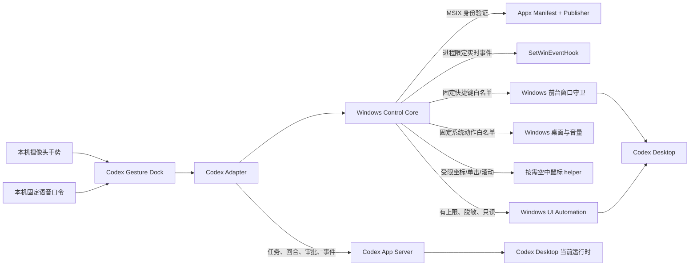

# Windows 桌面控制设计

本文定义 Codex Gesture Dock 的 Windows 桌面控制边界和演进路线。目标不是做通用远程控制器，而是为 Codex 工作流提供可观察、可撤销、白名单化的桌面操作。

## 当前架构

Dock 目前分为两个独立层级：

1. **Codex Adapter**：读取任务和完成文件，启动或追加回合，处理由 Dock 发起回合产生的命令/文件审批，并监听线程、回合和条目事件；同时声明 Codex 可用的桌面动作能力。
2. **Windows Control Core**：一方面验证 `OpenAI.Codex` MSIX 身份、进程与前台窗口，只对验证通过的 Codex 发送固定语义动作；另一方面提供 6 个不针对特定程序的固定系统动作（显示桌面、任务视图、资源管理器、音量增减和静音），以及用户明确选择后才启用的空中鼠标。三类动作共用持久化急停和限流。核心不接收任意按键、文本、脚本、窗口句柄或控件选择器；空中鼠标只接收当前显示器内的受限坐标、左键单击和固定步长滚动。

App Server 的初始化、线程/回合 API、审批请求和流式通知遵循 [OpenAI Codex App Server protocol](https://learn.chatgpt.com/docs/app-server)。

启动时 Dock 会优先发现 Codex Desktop 最新的版本化运行时，而不是旧的稳定路径；界面分别显示 Codex Adapter、Windows Control Core、UI Automation、实时窗口事件和当前绑定任务的状态。用户在任务窗口选择任务后，任务绑定和 Windows 急停状态会保存在本机用户配置中。

当前只读检查最多观察 240 个节点、返回 80 个控件，只公开控件类型、AutomationId、可用状态和少量 Control Pattern 能力。编辑框、文档、文本、列表项、密码框及未知内容型控件的名称不会返回；Node 主进程还会执行第二次字段白名单和脱敏。

## 实现状态

| 模块 | 状态 | 当前范围 |
| --- | --- | --- |
| Codex Adapter | 完成（v1） | 自主管理 App Server 生命周期；统一任务、事件、审批、文件和桌面能力 |
| Windows Control Core | 完成（v1） | MSIX 身份、动作白名单、System32 PowerShell 绝对路径、前台守卫、急停与审计 |
| UI Automation 观察 | 可用（只读） | 有上限的元素树摘要与双重脱敏，不执行 Control Pattern |
| Windows 事件订阅 | 完成（v1） | 进程限定的 `SetWinEventHook`，自动附加、脱离和重连 |
| Codex 语义动作 | 完成（v1） | 固定动作经验证快捷键执行；UIA 无稳定业务控件时不伪造 Invoke |
| Windows 系统动作 | 完成（v1） | 6 项固定组合键；独立手势映射；不接受调用方提供的按键序列 |
| 空中鼠标 | 完成（v1） | 食指移动、稳定指向后捏合单击、张掌滚动；丢手/隐藏/审批时解除武装，并受急停、坐标边界、分类型限流和 helper 退避约束 |
| 本机语音命令 | 完成（v1） | 用户每次会话明确开启；19 条中英文固定语法；白名单二次验证、限流、启动超时与按需 helper |
| 通用多程序控制 | 设计完成、未开放 | 新程序必须增加独立 Adapter 和身份/动作策略，不提供任意程序入口 |

## 控制边界

| 能力 | 当前方式 | 边界 |
| --- | --- | --- |
| 任务读取与打开 | App Server + `codex://` | 仅本机 Codex 任务 |
| 继续、总结、审查、测试修复 | `turn/start` / `turn/steer` | 只发送固定意图模板 |
| 命令和文件审批 | App Server 服务端请求 | 仅 Dock 发起回合；只允许本次或拒绝 |
| Codex 快捷键动作 | Windows 前台守卫 | 固定动作白名单，不接收任意按键文本 |
| Windows 系统动作 | 固定系统键 helper | 仅桌面、任务视图、资源管理器和音量 6 项枚举动作 |
| 空中鼠标 | 受限 IPC + 常驻按需 helper | 只允许当前显示器工作区坐标、稳定指向后的左键单击和 ±1 固定步长滚动；审批出现即关闭；无键盘/拖拽/右键/目标语义 |
| 本机语音命令 | Windows `System.Speech` + 固定 Grammar | 只从随包中英文口令产生已知动作；不自由转写、不存音频、不发网络、不参与审批 |
| 窗口事件 | `SetWinEventHook` | 只绑定验证后的 Codex PID，不返回窗口正文 |
| 急停与审计 | IPC + 本机 JSONL | 状态持久化；审计仅含动作元数据，不含任务内容 |
| 文件打开与定位 | Electron shell | 仅来自 App Server 最近文件清单的短期 ID |
| 任意键盘输入、文字、脚本、窗口选择器、密码框 | 不支持 | 不进入默认能力范围 |

Dock 使用独立 App Server 连接，因此不能接管另一个客户端已经持有的审批弹窗。对于由 Codex Desktop 自身启动的回合，Dock 通过轮询任务状态保持可见性；只有从 Dock 发起的回合会把审批请求路由回 Dock。

## 分阶段路线

### 阶段 1：只读桌面观察

- [已完成] 枚举顶层 Codex 窗口，记录进程 ID、进程名和标题。
- [已完成] 使用 `SetWinEventHook` 订阅窗口显示、隐藏、前台、焦点、位置和名称变化，作用域限制到验证后的目标进程。
- [已完成] 在诊断界面展示能力检测结果，不通过 UI Automation 执行输入。

### 阶段 2：UI Automation 元素发现

- [已完成：只读摘要] 使用 Windows UI Automation 读取目标窗口的有限元素树、控件类型、AutomationId、脱敏名称和可用 Control Pattern。
- [已完成] 当前版本能力检测确认 WebView 只公开根结构，没有可稳定调用的业务控件；缺失时明确降级到验证快捷键，不使用文本或坐标选择器。

### 阶段 3：白名单语义动作

- [已完成] 只暴露快速对话、话筒、命令菜单、审查、终端、侧栏和任务搜索等固定语义动作。
- [已完成] 当前 UIA 不提供稳定业务 Pattern，因此使用固定快捷键桥；坐标点击不作为回退。
- [已完成] 每次执行前重新验证 MSIX 身份、进程和前台窗口；任何身份不一致都会失败关闭。
- [已完成] 独立 Windows 手势模式只暴露显示桌面、任务视图、打开资源管理器、音量增减和静音；主进程与 PowerShell helper 双重枚举校验。
- [已完成] 独立空中鼠标模式复用手部关键点，只暴露屏幕内移动、稳定指向后的左键单击和固定滚动；Renderer、Main 和 helper 三层验证结构与范围，丢手/隐藏/审批时解除武装，helper 失败后退避，且不把坐标点击作为 Codex 语义动作的回退。
- [已完成] 本机语音命令只在用户明确开启后以绝对 System32 PowerShell 路径启动固定 helper；PowerShell 只加载 19 条固定语法，Main 再次验证动作、短语长度和置信度并限流，关闭后忽略晚到输出。语音不能直接授权审批，经语音发起的 Codex/Windows 固定动作仍通过现有急停与身份边界。

### 阶段 4：策略与审批

- [已完成] 每个应用、窗口和动作都有独立白名单；没有通用“执行任意输入”入口。
- 文件系统、终端命令、凭证窗口和系统设置继续走显式审批。
- [已完成] 记录本机按日审计事件：动作名、目标进程、结果、身份状态和时间；不记录输入正文、任务消息或屏幕内容。
- [已完成] 为手势动作提供持久化紧急停止、冷却时间，并在动作发送前复核前台进程。

## Windows 平台限制

- Windows UI Automation 提供元素树、属性、Control Pattern 和事件，是后续语义控制的首选接口。[Microsoft UI Automation overview](https://learn.microsoft.com/en-us/windows/win32/winauto/uiauto-uiautomationoverview)
- `SetWinEventHook` 可把事件监听限制到进程或线程，适合低权限的只读窗口观察。[Microsoft SetWinEventHook](https://learn.microsoft.com/en-us/windows/win32/api/winuser/nf-winuser-setwineventhook)
- `SendInput` 受 User Interface Privilege Isolation 约束，只能向同等或更低完整性级别的进程注入输入，而且失败不一定明确报告为 UIPI 阻止。[Microsoft SendInput](https://learn.microsoft.com/en-us/windows/win32/api/winuser/nf-winuser-sendinput)
- Windows 对前台窗口切换有限制，因此控制器不能假定任何时候都能抢占焦点。[Microsoft foreground-window restrictions](https://learn.microsoft.com/en-us/windows/win32/api/winuser/nf-winuser-allowsetforegroundwindow)

## v1 完成边界

Codex Adapter、面向 Codex 的窗口控制、固定 Windows 系统动作、用户驱动的空中鼠标和用户明确开启的本机固定语音已形成完整 v1 闭环。空中鼠标提供的是类似物理鼠标的显式指针输入，不理解当前应用、按钮语义或内容；语音只是已有白名单动作的另一个受限入口。两者都不会代替 Codex Adapter 的身份与动作白名单。未来增加浏览器、Office 等程序的语义控制时，仍必须新增独立 Adapter、可信应用身份策略、动作白名单和测试矩阵；不会把现有接口扩展成任意键盘、文本、命令、脚本或窗口选择器。
